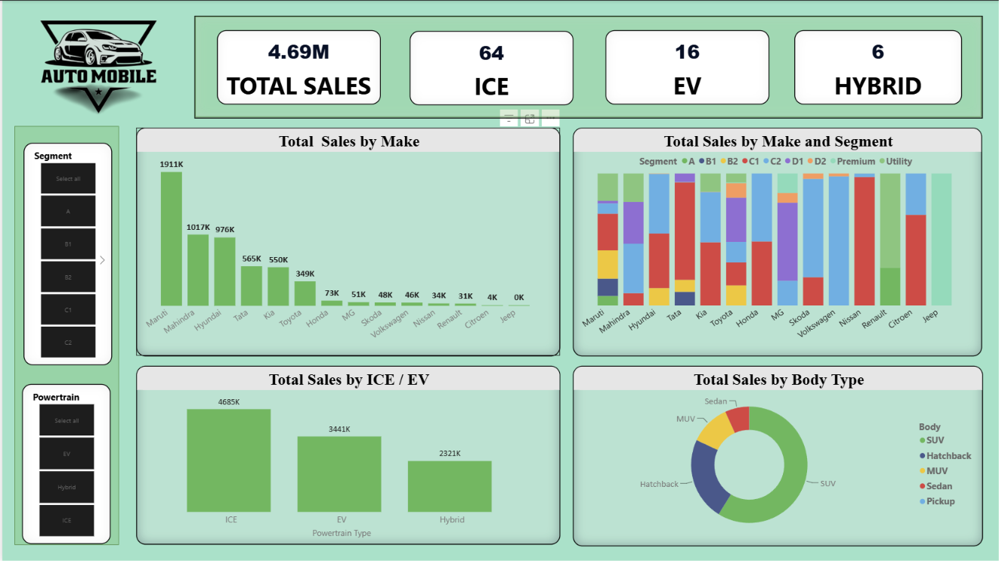
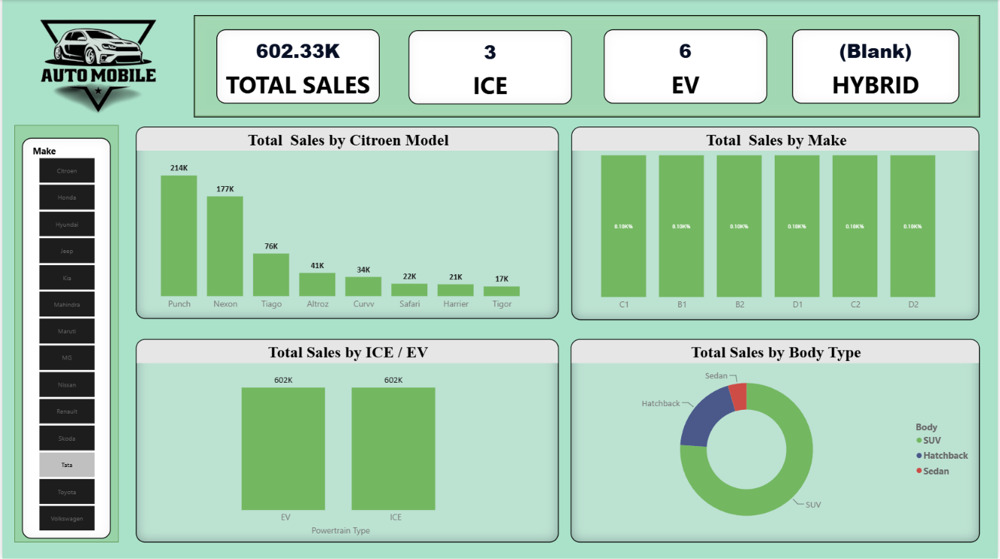
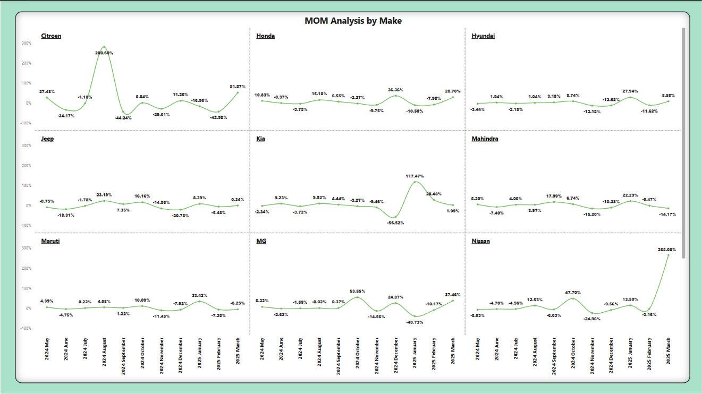

# 🚗 Automobile Sales Analysis & Market Shift Dashboard (FY2024–FY2025)

## 📌 Project Overview

This project presents an interactive Power BI dashboard developed to analyze the Indian automobile market for FY2024–FY2025. The dashboard provides comprehensive insights into vehicle sales performance, market trends, consumer preferences, and the transition from Internal Combustion Engine (ICE) vehicles to Electric Vehicles (EVs) and Hybrid vehicles.

The project demonstrates the complete Business Intelligence workflow - from data collection and preparation to data modeling, DAX calculations, and interactive dashboard development - enabling users to explore automobile sales using dynamic visualizations and filters.

---

# 🎯 Project Objectives

The primary objectives of this project are to:

- Analyze automobile sales performance across leading manufacturers.
- Compare sales of ICE, EV, and Hybrid vehicles.
- Understand vehicle sales by body type and market segment.
- Identify top-performing automobile brands.
- Analyze Month-on-Month (MoM) sales trends.
- Build an interactive dashboard to support data-driven decision-making.

---

# 📊 Dashboard Features

The dashboard consists of multiple report pages containing interactive visualizations and KPIs.

### KPI Cards

- Total Sales
- Number of ICE Models
- Number of EV Models
- Number of Hybrid Models

### Interactive Visualizations

- Total Sales by Manufacturer
- Sales by Vehicle Make and Market Segment
- ICE vs EV vs Hybrid Sales Comparison
- Sales Distribution by Vehicle Body Type
- Month-on-Month Sales Analysis
- Dynamic Filters and Slicers
- Multi-page Interactive Dashboard

---

# 📂 Data Source

The automobile sales data used in this project was compiled from publicly available sales reports available on the **AutoPunditz** website.

Monthly sales figures, vehicle information, and market insights were collected from multiple relevant AutoPunditz articles covering FY2024–FY2025.

Since the information was originally published in article and image format, the data was manually extracted, verified, and converted into a structured Microsoft Excel dataset before being imported into Power BI.

**Data Source**

AutoPunditz – Publicly Available Indian Automobile Sales Reports

**Note:** The dataset included in this repository is a processed version created solely for educational, analytical, and portfolio purposes.

---

# 🔄 Data Preparation

The dataset was prepared using the following process:

- Collected monthly automobile sales reports from AutoPunditz.
- Extracted numerical data from images and published reports.
- Manually entered and organized the extracted data into a structured Microsoft Excel dataset.
- Cleaned and standardized the data.
- Removed inconsistencies and duplicate records.
- Built lookup tables and established relationships.
- Created calculated columns and DAX measures.
- Developed a star-schema data model for efficient reporting.

---

# 📈 Key Business Insights

The dashboard enables users to answer important business questions such as:

- Which automobile manufacturer recorded the highest sales?
- What percentage of sales comes from ICE, EV, and Hybrid vehicles?
- Which vehicle body type dominates the Indian automobile market?
- Which market segments contribute the highest sales?
- How are sales changing month over month?
- How is the market shifting toward electric mobility?

---

# 🛠️ Technologies Used

- Microsoft Power BI Desktop
- Microsoft Excel
- Power Query
- DAX (Data Analysis Expressions)
- Data Modeling
- Business Intelligence
- Data Visualization

---

# 📊 Power BI Concepts Applied

## Data Preparation

- Data Cleaning
- Data Transformation
- Data Validation
- Data Formatting

## Data Modeling

- Relationship Management
- Calendar Table
- Measure Table
- Star Schema Design

## DAX Measures

Examples include:

- Total Sales
- Previous Month Sales
- Month-on-Month Growth
- Year-on-Year Growth
- Market Share
- EV Percentage
- ICE Percentage
- Hybrid Percentage

## Visualizations

- KPI Cards
- Clustered Column Charts
- Stacked Column Charts
- Donut Charts
- Interactive Slicers
- Filters
- Multi-page Dashboard Navigation

---

# 📷 Dashboard Preview

## Page 1 – Segment-wise Sales Dashboard

Displays:

- Total Sales KPI
- ICE, EV, and Hybrid KPI Cards
- Sales by Manufacturer
- Sales by Market Segment
- Sales by Body Type
- Segment Filters

### Sales Overview

## Page 2 – Manufacturer-wise Sales Analysis

Provides detailed manufacturer-level sales performance and comparisons.

### Brand Performance

## Page 3 – Month-on-Month Sales Analysis

Analyzes monthly sales trends, growth patterns, and performance variations.

### MoM Analysis – Brand wise

# 💼 Skills Demonstrated

- Business Intelligence
- Data Analytics
- Dashboard Development
- Power BI
- Power Query
- DAX
- Data Modeling
- Data Cleaning
- Data Visualization
- KPI Development
- Analytical Reporting
- Interactive Dashboard Design

---

# 🚀 Future Enhancements

Potential improvements for this project include:

- Publish the dashboard to Power BI Service.
- Integrate live automobile sales data.
- Add forecasting and trend analysis.
- Implement Row-Level Security (RLS).
- Develop mobile-optimized dashboards.
- Automate periodic data refresh.

---

# 👩‍💻 Author

**R.P.Keerthana**

PGDDSBA- Data Science & Business Analytics 

Thiagarajar School of Management,Madurai

